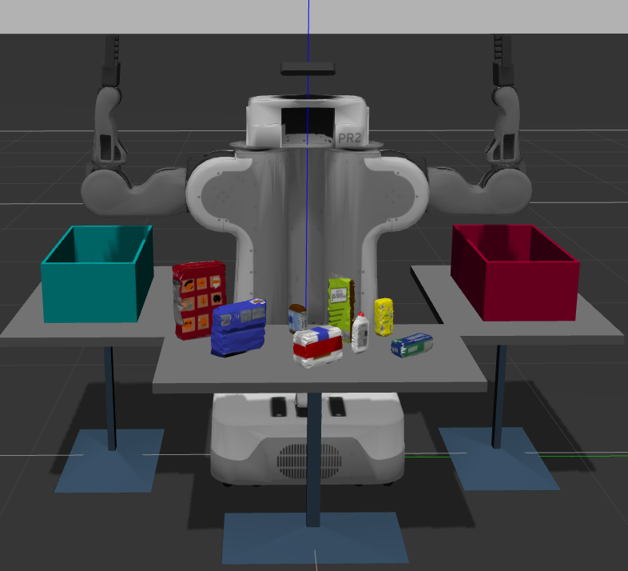
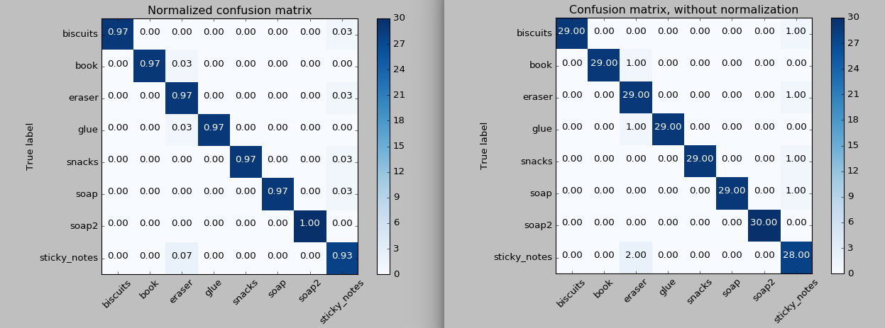
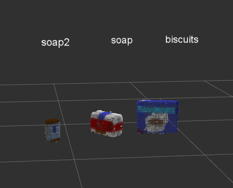
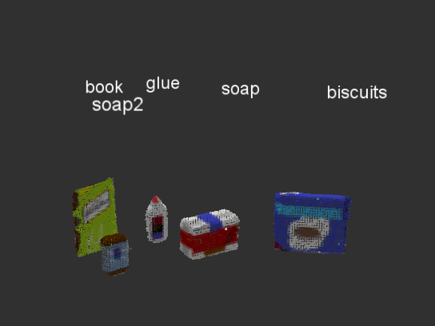
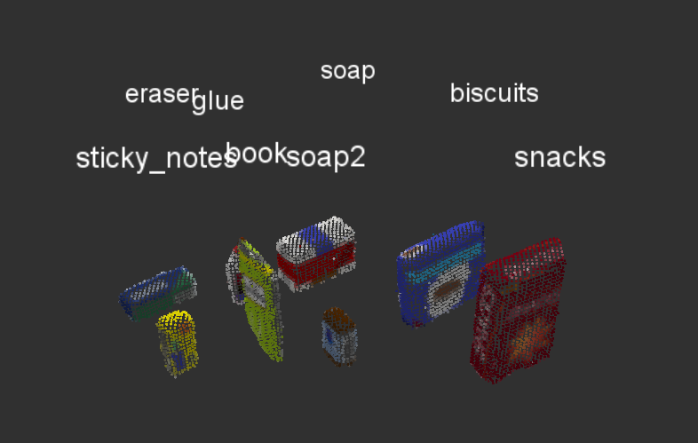
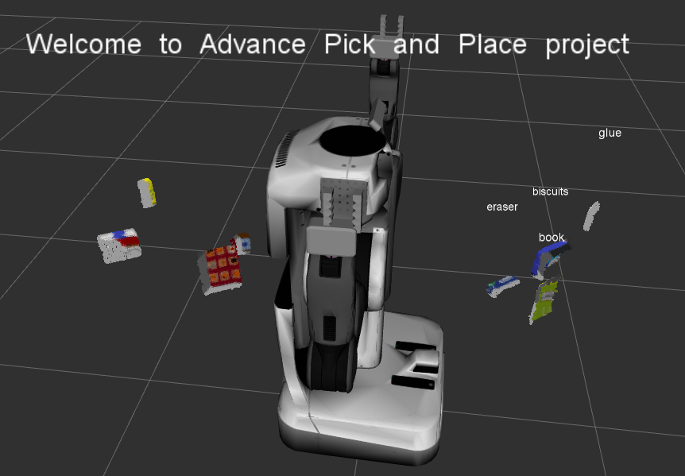

# Project: Perception Pick & Place

This project is on 3D perception. It uses a advanced robotics platform called the PR2 in simulation together with RBG-D data.

## Perception Exercise 1, 2 and 3

This project is built on top of the Perception exercises provided by Udacity RoboND. The link to the completed exercise. It also contains a [writeup](
https://github.com/lisaljl/Udacity-RoboND-Perception/blob/master/writeup.md) that explains all the techniques explored.

https://github.com/lisaljl/Udacity-RoboND-Perception

#### Exercise 1
Please refer to code for implementation

#### Exercise 2
Please refer to code for implementation

#### Exercise 3
Please refer to code for implementation
For training with svm, it generates 30 data sets for each object. For the historgram, bin 32 is used, together with HSV. The SVM parameters was slightly tweaked  to use kernel = linear, C = 1.0 (default) and gamma = 'auto'

## Perception project

There are 3 different scenarios (tabletop setups), where the number and type of objects differs for the different scenarios. Below are the results:

#### Test1 world and pick list 1

[Output yaml](https://github.com/lisaljl/Udacity-RoboND-Perception-Project/blob/master/pr2_robot/output/output_1.yaml)
Managed to detect 3/3 objects

#### Test2 world and pick list 2

[Output yaml](https://github.com/lisaljl/Udacity-RoboND-Perception-Project/blob/master/pr2_robot/output/output_2.yaml)
Managed to detect 5/5 objects

#### Test3 world and pick list 3

[Output yaml](https://github.com/lisaljl/Udacity-RoboND-Perception-Project/blob/master/pr2_robot/output/output_3.yaml)
Managed to detect 8/8 objects

### Walkthrough

Explaining [code in project template](./pr2_robot/scripts/project_template.py). Here are the steps required to detect objects from surroundings:

1. Get input from ROS, and convert to point cloud
2. Satistical filtering to remove noise
3. Voxel grid downsampling
4. PassThrough Filter using the different axes
5. RANSAC Segmentation using the Plane model
6. Extract inliers and outliers through the segmentation
7. Euclidean Clustering using kd tree
8. Create Cluster-Mask Point Cloud to visualize each cluster separately
9. Classify the clusters! (loop through each detected cluster one at a time)
10. Grab the points for the cluster
11. Compute the associated feature vector
12. Make the prediction
13. Publish a label into RViz
14. Add the detected object to the list of detected objects.

### Techniques

#### Satistical outlier filtering
This is used to remove noise from the images. The mean represents the number of neighbours, and the standard deviation represents the allowed standard deviation of the mean distance from the query point. A mean of 10 and standard deviation of 0.01 seems to remove most of the noise 

#### Voxel grid sampling
A leaf size of 0.007 is used. A small leaf size can be used however the cost is higher processing and more points created. 0.007 was found the be the threshold, any larger causes a lost in features and some problems were faced when trying to perform clustering. 0.006 seems to be a good number too, but 0.007 is used for performance.

#### PassThrough filter
Passthrough filters images based on the axes. By knowing the environment, passthrough filter is the easiest way to include and exclude certain items. In this task, passthrough filter in the z axis was used to only include the table and items on the table, by removing the table legs. An extra passthrough filter along the y axis was used to remove the table edge

#### RANSAC segmentation
For RANSAC, we chose a plane model, as we know we are removing a flat plane (the table). The maximum distance was varied according to trial and error to remove the table item, extracting the inliers and outliers to separate the table and the objects

#### Euclidean clustering
After obtaining only the point clouds of the objects, we use Euclidean to do clustering of the different objects. We first remove all RBG colors of the point clouds, converting it from xyzrbg to point cloud xyz. The points are now all white, by tweaking the cluster tolerance and minimum and maximum cluster size, clusters from the same object can be obtained. The cluster tolerance depends on how discrete the point cloud distance are. The minimum and maximum allows it to remove clusters that are too big or too small. These values are very important if the object sizes are known. The cluster size is also dependent on the leaf size from voxel grid sampling. The point cloud is now able to identify separate objects from the point clouds.

#### Feature association
Now we have the points clouds which has all the objects, and the clusters for each object. With this we can extract the features for each object (based on the obtained cluster) from the point cloud. HSV is used instead of RGB to accommodate for different lighting. A bin size of 32 is used and a range of 0 to 256. One thing is to ensure that the same bin size and range were used when training the date. The objects are then passed through two histograms to be compared with the trained data: color in HSV and surface normal. Using SVM for the trained data, the classifier is then able to predict the object based on what has been trained previously

### Pitfalls
1. Parsing the wrong point cloud when doing Euclidean clustering
2. Training the data with a different bin and size and color range as when doing the prediction
3. A small set of training data is insufficient to be able to successfully predict objects with almost similar features, however too much data seems to cause overfitting at times, which causes wrong prediction too.

### Improvements
1. 30 datasets for each item seems to work well in identifying each items successfully, even in the challenge world. However there are times in the challenge world, where it'll mistake an item on the floor for a glue. This might be due to insufficient feature association, where a new feature might need to be introduced

## Perception challenge (incomplete)

#### Pick Place challenge

[pick_place.py](./pr2_robot/scripts/pick_place.py) contains the code for pick place objects
There was a problem where the collision map is not cleared whenever a new cluster is being subscribed. A way to clear the previous map is by calling the service clear_octomap 

#### Challenge world

[Challenge.py](./pr2_robot/scripts/challenge.py) contains the code for identifying objects in challenge world

[Video] (https://youtu.be/haTRSOkH3rI)
